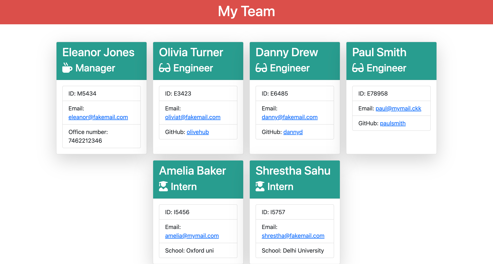
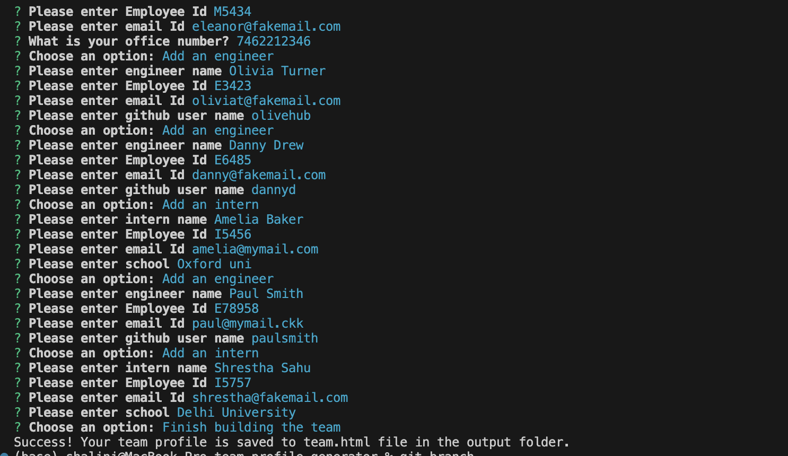
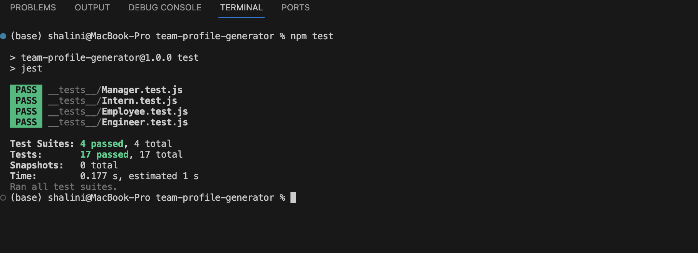

# Team Profile Generator

## Description
    
A command-line application using node.js, node fs(file system) and npm inquirer to accept user input as information of team members of a software engineering comapny and generate an HTML file with employee details. This application uses npm jest to test the application. 

## Table of Contents

- [User Story](#user-story)
- [Installation](#installation)
- [Usage](#usage)
- [Screenshot](#screenshot)
- [Contibuting](#contribution)
- [Tests](#tests)
- [License](#license)
- [Questions](#questions)

## User Story

As a manager of a software company, I want to generate a webpage that displays my team's basic information so that I can have quick access to their emails and Github profiles.

## Installation
    
This application requires installation of node.js and npm inquirer in order to be run successfully. Follow the instructions to install node.js. To use npm, open the terminal in the correct directory and type npm init -y to create a package.json file. Now type npm i inquirer@6.5.0 to install a compatible version of inquirer.

## Usage

To use the applicaiton, Navigate to the correct folder of the project, open terminal and type node index.js to run the application.\ 
You will be provided with a series of prompts about the manager.  Answer the questions. Note that input is validated and you will be prompted if you leave the input blank or provide incorrect formats of email id and office number.\
You will then be provided with a menu from which you can choose to add an intern or an engineer or finish building your team.\
Choose an option and follow the prompts to enter information of each team member.\
Once done, choose 'Finish building the team' from the menu.\
An HTML file named team.html should be generated in the output folder in the project directory. It should be similar to the screenshot below when run in the browser.

## Screenshot

## Contributing

To contribute to this project, clone the git repository and commit to a new branch.

## Tests

The application was tested using the jest npm package. 

## License

MIT License

## Questions

Visit my [Github Profile](https://github.com/ShaliniSunkuru)

More questions? Reach out to me by [email](mailto:shalini.sunkuru@gmail.com)